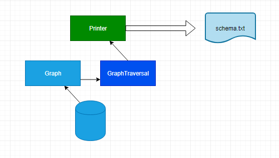
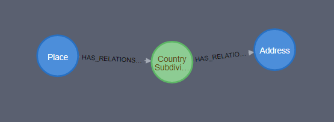
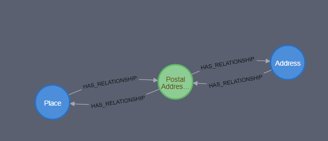
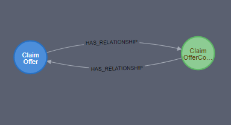

# Gqlschema

## Overview
Gqlschema is a tool that generates Graphql schema based on the ACORD graph data 
model stored in Neo4j. The ACORD Reference Architecture is an enterprise architecture
 framework for the insurance industry.  It consists of business processes, product models, development frameworks, information models, data models, and capability 
 models which help organizations to run, develop, modify, and maintain various insurance industry applications.
 
 ## Why?
 We wanted to expose the ACORD data model as GraphQL endpoint by using a schema file. 
## How
Gqlschema reads the data model from Neo4j by using Object Graph Model classes. 
The content is stored in Java collections. By using Java lambda functions the program traveses
these and prints the output into a schema file. The schema file can be then published
to Prisma or AppSync and expose a GraphQL endpoint. 

 ### Gqlschema components
 Gqlschema consist mainly of three componets
 
 * Graph maintains session to Noe4j. Reads the content of the graph and stores it 
 in OGM objects. 
 * GraphTravesal contains the data dictionary and application logic
 * Printer writes the output provided by GraphTraversal to a schema file
 


 
 
  #### The data dictionary
  The data dictionary contains ACORD objects and their 
  relationships. It is organized in the format of
  RDF triples. RDF Triple is an actual expression that defines a 
  way in which you can represent a relationship between objects.
   There are three parts to a triple: Subject, Predicate and Object (typically written in the same order). 
  A predicate relates subject to object. 
  
  Allthough, the RDF semantics are there we do not overemphasize its importance.
  The order of the parts is shuffled sometimes to accommodate the requriements
  of the schema. We also refer to them as left hand side or right hand side
  depending on where in the file they are going to be printed. 
  
  #### One to Many/Many to One
  Relationship between Place and Address in Neo4j:
  
   

  Will be represented in data dictionary manyToOneLHS collection:
  ```
   {Place[[Address,CountrySubdivisionDelivery Address,Place]]}             
  ```
  and manyToOneRHs collection:
   ```
     {Address[[Place,CountrySubdivisionDelivery Address,Address]]}             
   ```
   and in the schema:
  ```
    type Place
    {
        AddressByCountrySubdivisionDeliveryAddress: [Address]  @relation(name:"Place_CountrySubdivisionDeliveryAddress")
    }
    type Address
    {
        PlaceByCountrySubdivisionDeliveryAddress: Place @relation(name:"Place_CountrySubdivisionDeliveryAddress")
    }        
   ```
#### Many to Many
Many to many relationship between Place and Address in Neo4j:



In manyToManyLHS collection:

```
   {Place[[Address, Postal AddressPostal Municipality, Place]]}             
  ```
  
  in manyToManyRHS collection:
  
  ```
     {Address[[Place, Postal AddressPostal Municipality, Address]]}             
   ```
   and in the schema:
   
   ```
       type Place
       {
          AddressByPostalAddressPostalMunicipality: [Address]  @relation(name:"M:N_PostalAddressPostalMunicipality")
       }
       type Address
       {
          Place: [Place]  @relation(name:"M:N_PostalAddressPostalMunicipality")
       }        
   ```
 #### Self Referencing 
 Self referencing relationship for Claim Offer in Neo4j:
 
   
 
 In selfRefs collection: 
 ```
    {ClaimOffer[[ClaimOffer, Claim OfferComprising Claim Offer, ClaimOffer]]}             
   ```
   and in the schema:
      
   ```
       type ClaimOffer
       {
          ClaimOfferComprisingClaimOffer: [ClaimOffer]  @relation(name:"IM_A146912821")
       }
          
   ```
   
### Program Structure

* conf - Configuration
* images - Images
* src - Java code
  * graph -  Graph traversals and application logic
  * node - OGM classes
  * util - utility code

## Running the gqlschema 

gqlschema.jar accepts command line arguments:

```
    Option (* = required)  Description                          
    ---------------------  -----------                          
   
    * --config             Path to the config file

```
### Generate graphQL annotated schema
Run java program generating schema file.
```
java -jar gqlschema.jar --config conf/conf.yaml
```
### Program Structure

* conf - Configuration
* images - Images
* src - Java code
  * graph -  Graph traversals and application logic
  * node - OGM classes
  * util - utility code

### Config 
Config contains following parameters


* server_uri - Uri of the Neo4j server.
* server_username - username
* server_password - password
* schema - type of schema to be generated. "PRISMA" and "APPSYNC" are the valid options.

### Example
Example of a conf.yaml file

```
server_uri: "bolt://localhost:7687"
server_username:  "neo4j"
server_password: "password123"
schema: "PRISMA"
```

